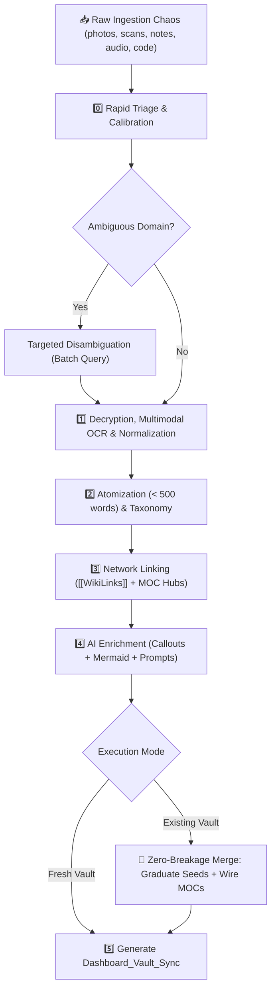
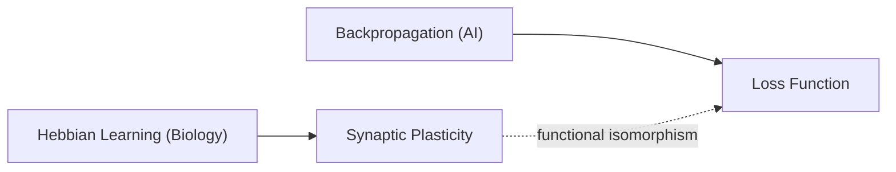

<div align="center">

# 🧠 Knowledge Brain
### *Neuro-Graph Architect (Omni-Zettelkasten AI)*

**Elite AI Epistemologist and Second Brain Architect for Obsidian**  
*Transforms chaotic notebook photos, handwriting scans, voice memos, and code into an interconnected Second Brain.*

---

[](LICENSE)
[](https://python.org)
[](https://obsidian.md)
[](#)
[](#)

---

</div>

## 📖 Overview

**Knowledge Brain** is a next-generation agentic skill engineered on **Niklas Luhmann's Zettelkasten** methodology, **Maps of Content (MOC)** frameworks, and **Progressive Summarization** principles.

Unlike generic note summary tools, Knowledge Brain operates as a **systems analyst and epistemologist**:
* Deciphers dense handwriting, whiteboard sketches, margin notes, and voice recordings.
* Atomizes continuous text into modular, standalone notes (`< 500 words`).
* Builds cross-disciplinary networks using bidirectional `[[WikiLinks]]` and `MOC` hubs.
* Uncovers unexpected structural parallels across domains (e.g., neural plasticity vs distributed network consensus).
* Supports **continuous, incremental knowledge ingestion** into pre-existing vaults with a strict **Zero Breakage** guarantee (no overwritten notes, no broken links, no duplicate stubs).

---

## ⚡ Core Features

| Feature | Description |
| :--- | :--- |
| 🌐 **Source Language Fidelity** | Strictly retains the author's original language (Russian, English, etc.) for all generated notes, titles, quotes, and MOCs. Never forces translation. |
| 👁️ **Multimodal OCR** | Deciphers handwriting, margin arrows, strike-throughs, and hand-drawn whiteboard schematics. |
| 🧩 **Temporal Puzzle Reassembly** | Correlates notes written years apart to trace the genuine evolution of authorial thought. |
| 🧱 **Atomicity Principle** | Enforces one primary concept per note (< 500 words). Broad topics are structured via MOCs. |
| 🏷️ **Matrix Taxonomy** | Multi-dimensional tagging across domains (`#domain/...`), types (`#type/...`), and maturity (`🌱 seed`, `🌿 sapling`, `🌳 evergreen`). |
| ⚖️ **Empirical & Hypothesis Boundary** | Strict separation between verified empirical facts (`#truth`) and author intuitions (`#hypothesis`). |
| 🛡️ **Preservation of Authentic Errors** | Original mistakes are preserved and annotated with `> [!fail]` callouts to maintain historical thought lineages. |
| 🤖 **Transparent AI Enrichment** | All machine deductions and syntheses are isolated within dedicated callout containers (`> [!ai-insight]`, `> [!synthesis]`). |
| 📊 **Visual Schematics (Mermaid + Prompts)** | Native Mermaid graphs inside notes + production-ready prompts for Midjourney v6 / Flux.1 image generation. |
| 🔄 **Continuous Vault Evolution** | Seamlessly merges new batches into existing vaults without regressions, duplicating concepts, or breaking links. |
| 🔗 **Selective Epistemic Linking** | High-signal relation markers (`Requires:`, `Contradicts:`) applied selectively only where genuine dependencies exist, preserving clean associative links by default. |
| 🏠 **Meta-Sync Dashboards** | Concludes each session with an executive `Dashboard_Vault_Sync` summarizing clusters, blind spots, and graph topology. |

---

## 🧭 Pipeline Architecture



---

## 🗂️ Repository Structure

```text
knowledge-brain/
├── 📄 SKILL.md                 # System instructions and specification for AI agents
├── 📄 README.md                # Project documentation and guides
├── 📄 .gitignore               # Git ignore rules
├── 📁 templates/               # Standardized Markdown templates for Obsidian
│   ├── atomic-note.md          # Atomic note template (concept, model, protocol)
│   ├── moc-hub.md              # Map of Content navigation hub template
│   ├── dashboard.md            # Vault synchronization dashboard template
│   ├── person-note.md          # Researcher / Author profile template
│   └── conflict-arbitration.md # Contradiction arbitration & thought evolution template
├── 📁 scripts/                 # Automation & validation CLI utilities
│   ├── prepass_manifest.py     # Ingestion pre-scanner, domain detector, and batcher
│   ├── vault_indexer.py        # Pre-existing vault indexer (Zero Breakage)
│   └── validate_vault.py       # Standards & link consistency validator
└── 📁 examples/                # Production-grade reference samples
    ├── example-atomic-note.md  # Sample atomic note
    ├── example-moc.md          # Sample Map of Content
    └── example-dashboard.md    # Sample master sync dashboard
```

---

## 🚀 Operational Slash Commands

Any supported agent equipped with this skill recognizes the following commands:

| Command | Action |
| :--- | :--- |
| `/triage [folder]` | Perform rapid payload reconnaissance, detect domains, and trigger the 4 calibration questions. |
| `/ingest [files]` | Execute the complete ingestion pipeline to build a new Zettelkasten vault from scratch. |
| `/append [files]` | **Incremental Ingestion:** Wire new notes into existing MOCs, graduate `seed` stubs, and avoid duplicates. |
| `/sync` | Re-index the vault, validate internal link topology, and generate a fresh sync dashboard. |
| `/graduate [[Note]]` | Manually promote a stub note from `#status/seed` to mature `#status/evergreen`. |
| `/graph [topic]` | Generate an in-depth Mermaid topology diagram and dedicated MOC for a chosen topic. |
| `/enrich [[Note]]` | Surgically enhance a specific note with interdisciplinary analogies, formulas, and visual prompts. |
| `/resolve-conflict [[A]] [[B]]` | Perform dialectical arbitration between contradictory notes across different timeframes. |
| `/audit` | Inspect vault for dangling links, unexpanded `seed` stubs, and isolated orphan notes. |
| `/blindspots` | Produce an inventory of unexplored concepts requiring further research. |

---

## 🛠️ CLI Utilities

All scripts are written in standard Python 3 and operate seamlessly across Windows, macOS, and Linux without external dependencies.

### 1. Ingestion Scanner & Batcher (`prepass_manifest.py`)
Scans raw folders, estimates token density, detects candidate domains, and creates a safe batching manifest:
```bash
python scripts/prepass_manifest.py ./incoming_dump/
```

### 2. Existing Vault Indexer (`vault_indexer.py`)
Extracts a full structural snapshot of an active vault (titles, aliases, seed stubs, backlinks) to guarantee **Zero Breakage** during incremental additions:
```bash
python scripts/vault_indexer.py ./my-obsidian-vault/
```

### 3. Standards Validator (`validate_vault.py`)
Audits all `.md` files against Knowledge Brain specifications (YAML frontmatter, word count thresholds, callout tags, unresolved `[[WikiLinks]]`):
```bash
python scripts/validate_vault.py ./my-obsidian-vault/
```

---

## 🔌 Installing into AI Coding Assistants

### Google Antigravity
* **Global configuration:**  
  Copy to `~/.gemini/config/skills/knowledge-brain/`
* **Workspace project configuration:**  
  Copy to `.agents/skills/knowledge-brain/` in your workspace root.

### Claude Code / Cursor / Codex
Reference [`SKILL.md`](SKILL.md) in your project instructions (`CLAUDE.md`, `.cursorrules`, or system prompt configuration).

---

## 📑 Sample Generated Note

```markdown
---
id: 20261009-1430
title: "Neural Network Plasticity (Bio vs AI)"
type: concept
tags: [domain/neurobiology, domain/ai/deep-learning, type/concept, status/evergreen, truth]
sources: ["Notebook_2018.jpg", "LLM_Architecture_2024.md"]
ai_enriched: true
created: 2026-10-09
---

# 🧠 Neural Network Plasticity (Bio vs AI)

## 📌 Core Idea
> [!abstract] Key Takeaway
> Biological synapses adapt locally (STDP/Dopamine), while artificial neural network weights update via global gradient backpropagation.

## 📝 Analysis & Primary Source
> [!quote] Source Note (2018)
> "The brain updates connections based on error. Synapse strengthens when prediction matches reality."

## 🧠 AI Enrichment & Context
> [!ai-insight] Architect's Analysis
> The author describes **Hebbian Learning** ("Neurons that fire together, wire together"). Biological brains consume ~20W through localized plasticity rules.

## 🔗 Cross-Domain Links
- **Related Concepts:** [[Hebbian Learning]], [[Backpropagation Algorithm]]
- **Hub:** [[MOC - Cognitive Systems and AI]]

## 📊 Visualization

```

---

## 📜 License

Distributed under the [MIT](LICENSE) License.
