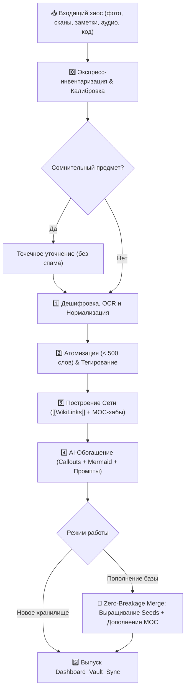
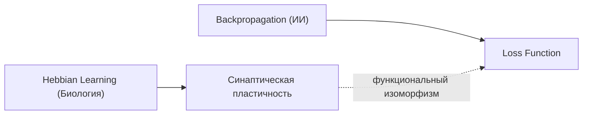

<div align="center">

# 🧠 Knowledge Brain
### *Архитектор Нейро-Графа (Omni-Zettelkasten AI)*

**Элитный ИИ-эпистемолог и архитектор персональных баз знаний для Obsidian**  
*Превращает неструктурированный хаос тетрадей, сканов, голосовых заметок и кода в живой, взаимосвязанный Second Brain.*

---

[](LICENSE)
[](https://python.org)
[](https://obsidian.md)
[](#)
[](#)

---

</div>

## 📖 О проекте

**Knowledge Brain** — это агентный скилл нового поколения, спроектированный по методологии **Zettelkasten (Никлас Луман)**, концепции **Maps of Content (MOC)** и принципам **Progressive Summarization**.

В отличие от простых генераторов конспектов, Knowledge Brain действует как **системный аналитик и эпистемолог**:
* Распознает сложный рукописный почерк, схемы с маркерных досок, маргиналии и аудиозаметки.
* Дробит сплошной текст на атомарные кирпичики (`< 500 слов`).
* Строит сеть связей через двусторонние ссылки `[[WikiLinks]]` и хабы `MOC`.
* Находит неожиданные междисциплинарные параллели (например, между нейробиологией и распределенными сетями).
* Позволяет **постепенно пополнять базу знаний** новыми пачками данных с гарантией **Zero Breakage** (ничего не ломается, старые заметки не перезаписываются, ссылки не бьются).

---

## ⚡ Ключевые возможности

| Функция | Описание |
| :--- | :--- |
| 👁️ **Мультимодальный OCR** | Распознавание рукописей, стрелок, зачеркиваний, полей тетрадей и набросков схем. |
| 🧩 **Сборка пазла во времени** | Сопоставление заметок, написанных с разницей в годы, и выявление эволюции мысли автора. |
| 🧱 **Принцип атомарности** | Строго одна ключевая идея на заметку (лимит 500 слов). Крупные темы собираются через MOC. |
| 🏷️ **Матрица таксономии** | Тегирование по доменам (`#domain/...`), типам (`#type/...`), зрелости (`🌱 seed`, `🌿 sapling`, `🌳 evergreen`). |
| ⚖️ **Разделение фактов и гипотез** | Четкое разграничение проверенных фактов (`#truth`) и авторских предположений (`#hypothesis`). |
| 🛡️ **Сохранение ошибок автора** | Ошибки не удаляются, а маркируются через `> [!fail]` с сохранением хроники рассуждений. |
| 🤖 **Прозрачное AI-обогащение** | Все дополнения модели помещаются в фирменные callouts (`> [!ai-insight]`, `> [!synthesis]`). |
| 📊 **Визуализация (Mermaid + AI Prompts)** | Интерактивные графы прямо в тексте + готовые промпты для генерации иллюстраций в Midjourney v6 / Flux.1. |
| 🔄 **Инкрементальная эволюция** | Бесшовное добавление новых порций заметок в существующий граф без дубликатов и конфликтов. |
| 🏠 **Мета-Дашборды синхронизации** | Генерация сводного листа `Dashboard_Vault_Sync` со списком хабов, слепых зон и макро-графом. |

---

## 🧭 Архитектура пайплайна



---

## 🗂️ Структура репозитория

```text
knowledge-brain/
├── 📄 SKILL.md                 # Полная системная инструкция для ИИ-агентов
├── 📄 README.md                # Документация проекта
├── 📄 .gitignore               # Исключения Git
├── 📁 templates/               # Эталонные шаблоны заметок для Obsidian
│   ├── atomic-note.md          # Шаблон атомарной заметки
│   ├── moc-hub.md              # Шаблон карты контента (Map of Content)
│   ├── dashboard.md            # Шаблон дашборда синхронизации
│   ├── person-note.md          # Шаблон карточки исследователя/автора
│   └── conflict-arbitration.md # Шаблон арбитража противоречий
├── 📁 scripts/                 # CLI-утилиты автоматизации
│   ├── prepass_manifest.py     # Индексация входящего хаоса и батчинг
│   ├── vault_indexer.py        # Индексатор существующего хранилища
│   └── validate_vault.py       # Валидатор стандартов оформления заметок
└── 📁 examples/                # Готовые примеры файлов
    ├── example-atomic-note.md  # Образец атомарной заметки
    ├── example-moc.md          # Образец MOC-хаба
    └── example-dashboard.md    # Образец сводного дашборда
```

---

## 🚀 Оперативные команды (Slash Commands)

Любой агент с подключенным скиллом поддерживает быстрые команды:

| Команда | Описание |
| :--- | :--- |
| `/triage [папка]` | Быстрая разведка массива, группировка тем и 4 вопроса калибровки. |
| `/ingest [файлы]` | Полная обработка входящих материалов с развертыванием графа с нуля. |
| `/append [файлы]` | **Инкрементальное пополнение:** бережное вплетение в существующие MOC и выращивание `seed`-заметок. |
| `/sync` | Полная ресинхронизация графа, валидация связей и выпуск свежего Дашборда. |
| `/graduate [[Заметка]]` | Перевод заметки-заглушки из `#status/seed` в полноценную `#status/evergreen`. |
| `/graph [тема]` | Построение глубокой Mermaid-карты связей и MOC по выбранной теме. |
| `/enrich [[Заметка]]` | Точечное обогащение выбранной заметки научным контекстом и междисциплинарными связями. |
| `/resolve-conflict [[A]] [[B]]` | Диалектический арбитраж двух противоречащих друг другу заметок автора с таймлайном. |
| `/audit` | Поиск битых ссылок, нераскрытых `seed`-заглушек и изолированных заметок-сирот. |
| `/blindspots` | Вывод реестра «белых пятен» — тем, требующих дальнейшего изучения автором. |

---

## 🛠️ Вспомогательные CLI-скрипты

Все скрипты написаны на стандартном Python 3 и работают на любой ОС (Windows, macOS, Linux).

### 1. Подготовка и батчинг файлов (`prepass_manifest.py`)
Сканирует папку с хаосом, определяет типы файлов, оценивает размер и генерирует `manifest.json`:
```bash
python scripts/prepass_manifest.py ./incoming_dump/
```

### 2. Индексатор хранилища (`vault_indexer.py`)
Собирает полный слепок существующего хранилища (заголовки, алиасы, seed-заглушки, входящие и исходящие связи), гарантируя **Zero Breakage** при инкрементальном обновлении:
```bash
python scripts/vault_indexer.py ./my-obsidian-vault/
```

### 3. Валидатор стандартов (`validate_vault.py`)
Проверяет хранилище на соблюдение стандартов Knowledge Brain (YAML-заголовки, лимит слов, синтаксис callouts, битые ссылки):
```bash
python scripts/validate_vault.py ./my-obsidian-vault/
```

---

## 🔌 Как подключить скилл к агенту

### Google Antigravity
* **Глобально для всех проектов:**  
  Скопируйте репозиторий в `~/.gemini/config/skills/knowledge-brain/`
* **Локально для конкретного проекта:**  
  Поместите репозиторий в `.agents/skills/knowledge-brain/` внутри корня проекта.

### Claude Code / Codex / Cursor
Добавьте содержимое [`SKILL.md`](SKILL.md) в конфигурационный файл вашего ассистента (`CLAUDE.md`, `.cursorrules` или системный промпт агента).

---

## 📑 Пример сгенерированной заметки

```markdown
---
id: 20261009-1430
title: "Пластичность нейронных сетей (Био vs ИИ)"
type: concept
tags: [domain/neurobiology, domain/ai/deep-learning, type/concept, status/evergreen, truth]
sources: ["Тетрадь_2018.jpg", "LLM_Архитектура_2024.md"]
ai_enriched: true
created: 2026-10-09
---

# 🧠 Пластичность нейронных сетей (Био vs ИИ)

## 📌 Суть (Core Idea)
> [!abstract] Краткий тезис
> Биологические синапсы перестраиваются локально (STDP/Дофамин), а веса в ИИ — через глобальный градиент (Backprop).

## 📝 Разбор и фактура (Analysis)
> [!quote] Цитата из конспекта (2018 г.)
> "Мозг меняет связи на основе ошибки. Синапс усиливается, если предсказание совпало с реальностью."

## 🧠 Дополнение и Контекст (AI Enrichment)
> [!ai-insight] Аналитика Архитектора
> Описан принцип **Хебба** ("Neurons that fire together, wire together"). Биологический мозг потребляет ~20W благодаря локальным правилам пластичности.

## 🔗 Ассоциативные связи
- **Связанные концепты:** [[Обучение Хебба]], [[Алгоритм обратного распространения ошибки]]
- **Входит в хаб:** [[MOC - Когнитивные системы и ИИ]]

## 📊 Визуализация

```

---

## 📜 Лицензия

Распространяется под свободной лицензией [MIT](LICENSE).
