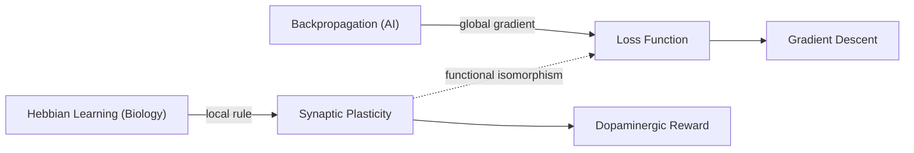

# 🧠 Neural Network Plasticity (Bio vs AI)

## 📌 Core Idea
> [!abstract] Key Takeaway
> Biological synapses adapt locally through spike correlation and neuromodulators (STDP/Dopamine), whereas artificial neural networks update weights via global backpropagation through a computation graph.

## 📝 Analysis & Primary Source
Biological synapses modulate connection strength based on coordinated activity between pre- and post-synaptic neurons. Dopamine surges function as a reinforcement signal (Reward Prediction Error).

> [!quote] Excerpt from 2018 Notebook
> "The brain updates connections based on error. Synapse strengthens when prediction matches reality. Dopamine as reward." — *Notebook 2018, p. 12*

## 🧠 AI Enrichment & Context
> [!ai-insight] Architect's Analysis
> The author describes **Hebbian Learning** ("Neurons that fire together, wire together"). While functional analogies exist with backpropagation, biological systems rely on localized learning rules (STDP), achieving remarkable energy efficiency (~20 Watts compared to megawatts in GPU clusters).

> [!synthesis] Interdisciplinary Synthesis
> Correlating the 2018 notes on dopamine with the 2024 notes on transformer loss functions: the loss function in deep learning is mathematically equivalent to homeostatic "discomfort" minimization under Karl Friston's Free Energy Principle.

## 🔗 Associated & Cross-Domain Links
- **Prerequisite (Requires):** [[Synaptic Transmission]]
- **Related Concepts:** [[Hebbian Learning]], [[Backpropagation Algorithm]], [[Dopaminergic System]]
- **Cross-Domain Analogy:** [[Market Price Adaptation in Economics]] (decentralized local agent adaptation without a global coordinator)
- **Hub:** [[MOC - Cognitive Systems and AI]]

## 📊 Visualization

> [!image-prompt] Concept Illustration (Flux / Midjourney)
> **Engine:** Flux.1 Dev / Midjourney v6
> **Prompt:** Scientific schematic diagram comparing biological synapse releasing dopamine with artificial neural network nodes receiving backpropagation gradients, split-view architectural layout, dark obsidian background, luminous cyan and amber pathways, technical typography, vector aesthetic, high clarity --ar 16:9
