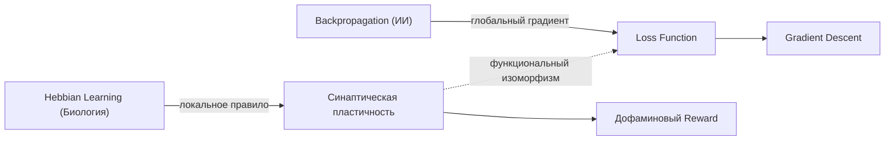

# 🧠 Пластичность нейронных сетей (Био vs ИИ)

## 📌 Суть (Core Idea)
> [!abstract] Краткий тезис
> Биологические синапсы перестраиваются локально под воздействием корреляции спайков и нейромедиаторов (STDP/Дофамин), тогда как в ИИ веса обновляются через расчет глобального градиента (Backpropagation).

## 📝 Разбор и фактура (Analysis)
Биологический синапс изменяет силу связи на основе совместной активности пресинаптического и постсинаптического нейронов. Дофаминовый всплеск выступает в качестве биологического сигнала подкрепления (Reward Prediction Error).

> [!quote] Цитата из конспекта (2018 г.)
> "Мозг меняет связи на основе ошибки. Синапс усиливается, если предсказание совпало с реальностью. Дофамин как reward." — *Тетрадь 2018, с. 12*

## 🧠 Дополнение и Контекст (AI Enrichment)
> [!ai-insight] Аналитика Архитектора
> Описанный автором принцип соответствует **правилу Хебба** (*"Neurons that fire together, wire together"*). В глубоком обучении его функциональным аналогом является алгоритм обратного распространения ошибки, однако искусственные нейросети требуют глобального расчета частных производных через вычислительный граф. Мозг же функционирует на основе локальных правил пластичности (STDP), что дает колоссальный выигрыш в энергоэффективности (~20 Ватт против сотен киловатт у кластеров GPU).

> [!synthesis] Междисциплинарный синтез
> В конспектах 2018 года автор рассматривает дофамин как сигнал подкрепления, а в записях 2024 года — функцию потерь (Loss Function) в трансформерах. 
> **Инсайт:** Loss Function можно трактовать как математический эквивалент гомеостатического «дискомфорта» биологической системы, минимизирующей энтропию по принципу свободной энергии Карла Фристона.

## 🔗 Ассоциативные связи (Cross-Domain Links)
- **Связанные концепты:** [[Обучение Хебба]], [[Алгоритм обратного распространения ошибки]], [[Дофаминергическая система]]
- **Аналогии в других сферах:** [[Рыночная адаптация в экономике]] (децентрализованная локальная реакция агентов без глобального планировщика)
- **Входит в хаб:** [[MOC - Когнитивные системы и ИИ]]

## 📊 Визуализация

> [!image-prompt] Иллюстрация концепта (Flux / Midjourney)
> **Engine:** Flux.1 Dev / Midjourney v6
> **Prompt:** Scientific schematic diagram comparing biological synapse releasing dopamine with artificial neural network nodes receiving backpropagation gradients, split-view architectural layout, dark obsidian background, luminous cyan and amber pathways, technical typography, vector aesthetic, high clarity --ar 16:9
