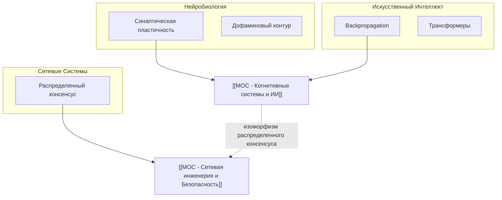

# 🏠 Dashboard: Синхронизация онтологии знаний

> **Дата обработки:** 2026-10-09 14:45  
> **Источник входящих данных:** `📥 Inbox/Batch_Archive_2018_2026`

---

## 📊 1. Сводка ингестии (Executive Summary)

В ходе сессии обработан массив разнородных заметок автора за период 2018–2026 гг. Сырой массив преобразован в структурированный Zettelkasten-граф с полным сохранением исходных формулировок и цитат.

| Метрика | Значение |
| :--- | :--- |
| **Обработано файлов** | 16 (8 фото тетрадей, 4 черновика .md, 2 транскрипта, 2 листинга кода) |
| **Создано атомарных заметок** | 14 |
| **Создано MOC-хабов** | 2 |
| **Сгенерировано Seed-заглушек** | 5 |
| **Выявлено эволюций/конфликтов мысли** | 1 |

---

## 🗺️ 2. Матрица хабов (MOC Matrix)

- [[MOC - Когнитивные системы и ИИ]] — 8 заметок (домены: нейробиология, ML, когнитивистика).
- [[MOC - Сетевая инженерия и Безопасность]] — 6 заметок (домены: криптография, сетевые протоколы, маршрутизация).

---

## ⚖️ 3. Эволюция взглядов и выявленные конфликты

| Тема / Узел | Ранняя позиция (2018) | Поздняя позиция (2024) | Анализ сдвига мысли |
| :--- | :--- | :--- | :--- |
| [[Эффективность централизованного обучения]] | *"Глобальный градиент — единственный путь к обучению сложных абстракций."* | *"Будущее за распределенными локальными агентами и нейроморфными чипами."* | Переход от увлечения монолитными LLM к осознанию энергетических ограничений датацентров. Оформлен арбитраж [[Арбитраж - Локальное vs Глобальное обучение]]. |

---

## 🕳️ 4. Слепые зоны (Blind Spots & Research Backlog)

> [!question] Пробелы в текущей онтологии
> 1. **[[Spike-Timing-Dependent Plasticity]]**: В конспекте 2018 года упомянута временная шкала миллисекундных задержек, но математическая модель кривой STDP не зафиксирована.
> 2. **[[Квантовые алгоритмы оптимизации]]**: Упомянуты в заметке по loss landscape как альтернатива градиентному спуску, но конкретные алгоритмы (QAOA) не описаны.

---

## 🌐 5. Глобальная архитектура связей (Mermaid Macro Graph)

