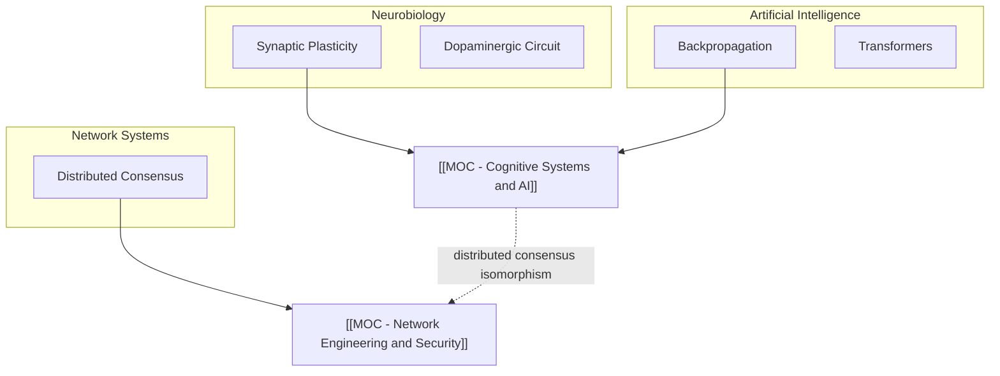

# 🏠 Executive Summary: Knowledge Ontology Synchronization

> **Delivery Mode:** In-Chat Session Report *(Pure Graph Policy — zero file pollution in Obsidian Graph View)*  
> **Sync Timestamp:** 2026-10-09 14:45  
> **Source Batch:** `📥 Inbox/Batch_Archive_2018_2026`

---

## 📊 1. Ingestion Summary (Executive Report)

This session processed a multi-modal batch of notes spanning 2018–2026. Raw files were transformed into a structured Zettelkasten graph with complete fidelity to author citations and terminology.

| Metric | Value |
| :--- | :--- |
| **Processed Files** | 16 (8 notebook scans, 4 markdown drafts, 2 audio transcripts, 2 code listings) |
| **Atomic Notes Created** | 14 |
| **MOC Hubs Created/Updated** | 2 |
| **Seed Stubs Generated** | 5 |
| **Contradictions Arbitrated** | 1 |

---

## 🗺️ 2. MOC Knowledge Matrix

- [[MOC - Cognitive Systems and AI]] — 8 connected notes (domains: neurobiology, machine learning, cognitive science).
- [[MOC - Network Engineering and Security]] — 6 connected notes (domains: cryptography, routing protocols, proxies).

---

## ⚖️ 3. Ideological Evolution & Detected Conflicts

| Concept / Node | Historical Stance (2018) | Contemporary Stance (2024) | Epistemic Shift Analysis |
| :--- | :--- | :--- | :--- |
| [[Centralized Learning Efficiency]] | *"Global gradients are the only viable path to complex abstractions."* | *"Decentralized local agents and neuromorphic circuits represent the sustainable future."* | Shift from monolithic LLM architectures toward energy-constrained edge agents. Captured in [[Arbitration - Local vs Global Learning]]. |

---

## 🕳️ 4. Blind Spots & Research Backlog

> [!question] Critical Knowledge Gaps
> 1. **[[Spike-Timing-Dependent Plasticity]]**: The 2018 notebook notes millisecond timing windows, but the mathematical STDP curve is not yet formalized in the vault.
> 2. **[[Quantum Optimization Algorithms]]**: Referenced cursorily as an alternative to stochastic gradient descent, but specific QAOA formulations are missing.

---

## 🌐 5. Global Macro Architecture (Mermaid)

