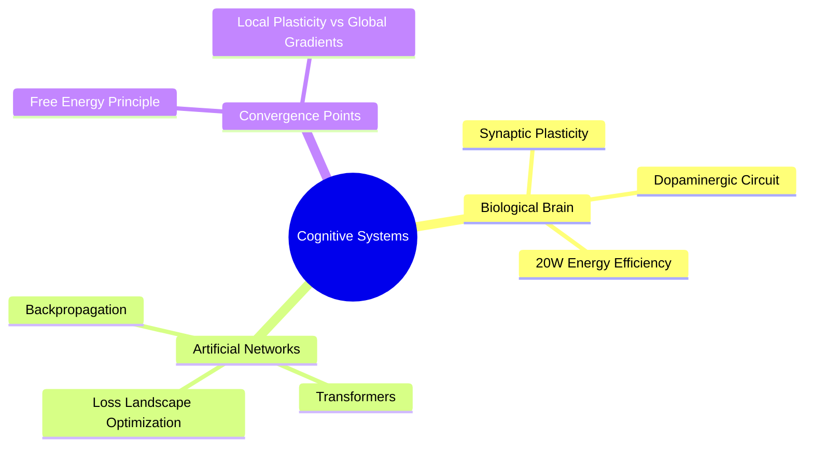

# 🗺️ MOC: Cognitive Systems and Computational Intelligence

## 🧭 Overview & Domain Scope
> [!abstract] Hub Summary
> This hub consolidates the author's research across neurophysiology (2018–2020) and modern deep learning architectures (2023–2026). The central inquiry is discovering structural isomorphisms between biological brain computation and artificial neural networks.

---

## 📂 Knowledge Clusters

### 1. Biological Substrate & Synaptic Plasticity
- [[Neural Network Plasticity (Bio vs AI)]] — Hebbian mechanics vs gradient descent backpropagation.
- [[Dopaminergic System]] — Reward prediction error dynamics as a learning signal.
- [[Spike-Timing-Dependent Plasticity]] — Millisecond temporal dynamics of synaptic weights.

### 2. Artificial Architectures
- [[Backpropagation Algorithm]] — Mathematical foundation of optimization in deep networks.
- [[Attention Mechanism in Transformers]] — Dynamic computational focus modeling.
- [[Karl Friston Free Energy Principle]] — Unifying thermodynamic framework for adaptive systems.

---

## 📊 Cluster Topology

---

## 🔍 Blind Spots & Backlog
> [!question] Unresolved Questions for this Hub
> - [ ] How does the biological brain solve Catastrophic Forgetting without complete dataset replay?
> - [ ] Can neuromorphic hardware with memristors achieve STDP energy efficiency competitive with modern GPU clusters?
