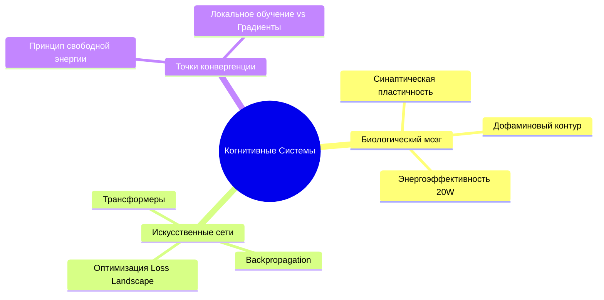

# 🗺️ MOC: Когнитивные системы и Вычислительный Интеллект

## 🧭 Введение и Контур Темы
> [!abstract] Обзор хаба
> Хаб объединяет записи автора по нейрофизиологии (2018–2020) и современные исследования в области искусственного интеллекта (2023–2026). Основная цель — исследовать изоморфизмы между биологическими вычислительными механизмами и архитектурами глубокого обучения.

---

## 📂 Кластеры Знаний

### 1. Биологический субстрат и Пластичность
- [[Пластичность нейронных сетей (Био vs ИИ)]] — сопоставление локального правила Хебба и глобального Backprop.
- [[Дофаминергическая система]] — механизм Reward Prediction Error как аналог градиентного шага.
- [[Spike-Timing-Dependent Plasticity]] — временные паттерны синаптических весов.

### 2. Искусственные Архитектуры
- [[Алгоритм обратного распространения ошибки]] — математический базис обучения градиентным спуском.
- [[Трансформеры и Механизм Внимания]] — моделирование динамического фокуса внимания.
- [[Принцип свободной энергии Карла Фристона]] — обобщающая термодинамическая теория адаптивных систем.

---

## 📊 Топология Кластера

---

## 🔍 Слепые зоны (Research Backlog)
> [!question] Нерешенные вопросы кластера
> - [ ] Как биологический мозг решает проблему катастрофического забывания (Catastrophic Forgetting) без полного повторения датасета?
> - [ ] Возможно ли эффективное аппаратное воплощение STDP на мемристорах в сравнении с GPU?
