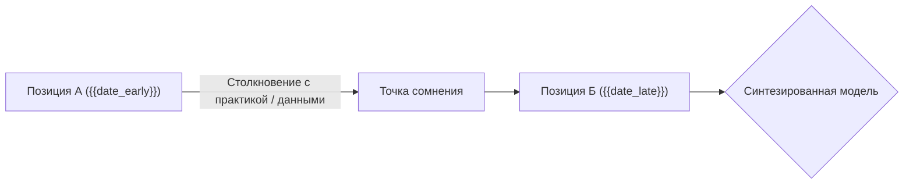

# ⚖️ Арбитраж противоречия: {{topic_conflict}}

## ⚔️ Стороны противоречия

### Позиция 1 (Ранняя мысль)
* **Источник:** [[{{source_note_early}}]] ({{date_early}})
* **Тезис:**
> [!quote] Цитата оригинала (Ранняя)
> "{{early_quote}}"

### Позиция 2 (Поздняя мысль)
* **Источник:** [[{{source_note_late}}]] ({{date_late}})
* **Тезис:**
> [!quote] Цитата оригинала (Поздняя)
> "{{late_quote}}"

---

## 🔬 Анализ Архитектора (Диалектический синтез)

> [!warning] Причина противоречия
> {{Анализ смены парадигмы: сменились вводные данные, произошел переход от наивного представления к зрелому, либо изменился контекст применения}}

> [!synthesis] Интегрированный вывод
> {{Синтезирующий вывод, устраняющий кажущееся противоречие или фиксирующий границы применимости обеих моделей}}

