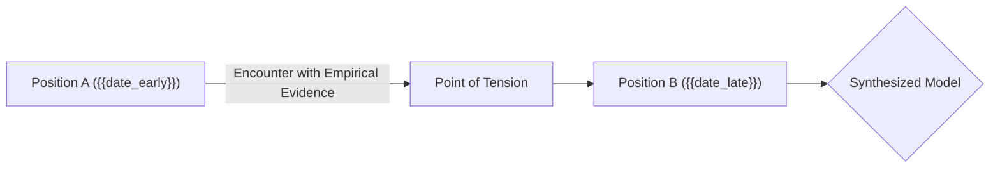

# ⚖️ Conflict Arbitration: {{topic_conflict}}

## ⚔️ Contradictory Positions

### Position 1 (Historical Thought)
* **Source:** [[{{source_note_early}}]] ({{date_early}})
* **Assertion:**
> [!quote] Source Quote (Historical)
> "{{early_quote}}"

### Position 2 (Contemporary Thought)
* **Source:** [[{{source_note_late}}]] ({{date_late}})
* **Assertion:**
> [!quote] Source Quote (Contemporary)
> "{{late_quote}}"

---

## 🔬 Dialectical Synthesis

> [!warning] Root Cause of Conflict
> {{Analysis of the paradigm shift: updated data, transition from naive heuristic to mature model, or divergent boundary conditions}}

> [!synthesis] Integrated Model
> {{Synthesizing conclusion resolving the apparent contradiction and mapping boundary conditions for both views}}

