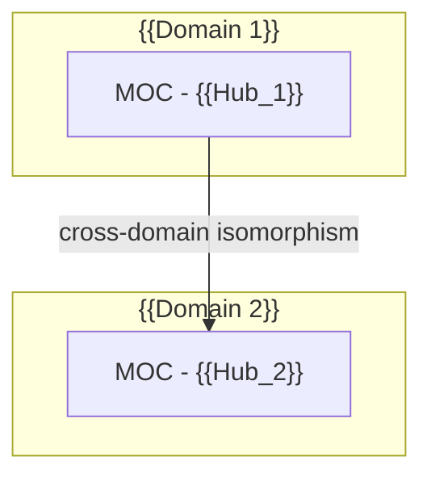

# 🏠 Dashboard: Knowledge Ontology Synchronization

> **Sync Timestamp:** {{date:YYYY-MM-DD HH:mm}}  
> **Source Batch:** {{batch_name_or_source_folder}}

---

## 📊 1. Ingestion Summary (Executive Report)

| Metric | Value |
| :--- | :--- |
| **Processed Files** | {{processed_files_count}} ({{images_count}} images, {{notes_count}} notes, {{code_count}} code, {{audio_count}} audio) |
| **Atomic Notes Created** | {{atomic_notes_count}} |
| **MOC Hubs Created/Updated** | {{moc_count}} |
| **Seed Stubs Identified** | {{seed_count}} |
| **Contradictions Arbitrated** | {{contradictions_count}} |

---

## 🗺️ 2. MOC Knowledge Matrix

- [[MOC - {{Hub_1}}]] — {{Brief status and connected note count}}
- [[MOC - {{Hub_2}}]] — {{Brief status and connected note count}}

---

## ⚖️ 3. Ideological Evolution & Detected Conflicts

| Concept / Node | Historical Stance (Source A) | Contemporary Stance (Source B) | Epistemic Shift Analysis |
| :--- | :--- | :--- | :--- |
| [[{{Concept_Conflict_1}}]] | "{{Thesis_A}}" (*{{Source_A}}*) | "{{Thesis_B}}" (*{{Source_B}}*) | {{Root cause of the author's viewpoint evolution}} |

---

## 🕳️ 4. Blind Spots & Research Backlog

> [!question] Critical Knowledge Gaps
> 1. **[[{{Missing_Topic_1}}]]**: Mentioned cursorily in the context of {{Context}}, but the underlying mechanism is unresolved.
> 2. **[[{{Missing_Topic_2}}]]**: Lacks empirical validation for hypothesis {{Hypothesis}}.

---

## 🌐 5. Global Macro Architecture (Mermaid)

