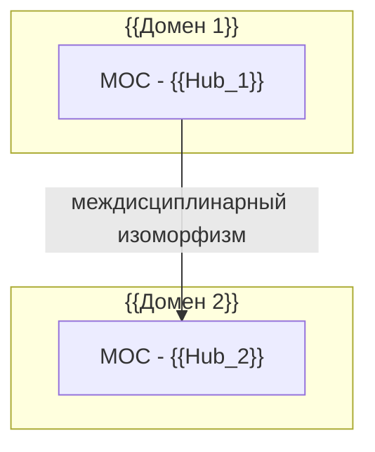

# 🏠 Dashboard: Синхронизация онтологии знаний

> **Дата обработки:** {{date:YYYY-MM-DD HH:mm}}  
> **Пакет входящих данных:** {{batch_name_or_source_folder}}

---

## 📊 1. Сводка ингестии (Executive Summary)

| Метрика | Значение |
| :--- | :--- |
| **Обработано файлов** | {{processed_files_count}} ({{images_count}} фото, {{notes_count}} заметок, {{code_count}} кода, {{audio_count}} аудио) |
| **Создано атомарных заметок** | {{atomic_notes_count}} |
| **Создано/обновлено MOC-хабов** | {{moc_count}} |
| **Выявлено семян (Seed-заглушек)** | {{seed_count}} |
| **Обнаружено противоречий** | {{contradictions_count}} |

---

## 🗺️ 2. Матрица хабов (MOC Matrix)

- [[MOC - {{Hub_1}}]] — {{Краткий статус и количество связанных заметок}}
- [[MOC - {{Hub_2}}]] — {{Краткий статус и количество связанных заметок}}

---

## ⚖️ 3. Эволюция взглядов и выявленные конфликты

| Тема / Узел | Ранняя позиция (Источник А) | Поздняя позиция (Источник Б) | Анализ сдвига мысли |
| :--- | :--- | :--- | :--- |
| [[{{Concept_Conflict_1}}]] | "{{Тезис_А}}" (*{{Source_A}}*) | "{{Тезис_Б}}" (*{{Source_B}}*) | {{Причина эволюции взглядов автора}} |

---

## 🕳️ 4. Слепые зоны (Blind Spots & Research Backlog)

> [!question] Критические пробелы в онтологии
> 1. **[[{{Missing_Topic_1}}]]**: Упомянут автором вскользь в контексте {{Контекст}}, но механизм не раскрыт.
> 2. **[[{{Missing_Topic_2}}]]**: Отсутствует экспериментальное подтверждение гипотезы {{Гипотеза}}.

---

## 🌐 5. Глобальная архитектура связей (Mermaid Macro Graph)

